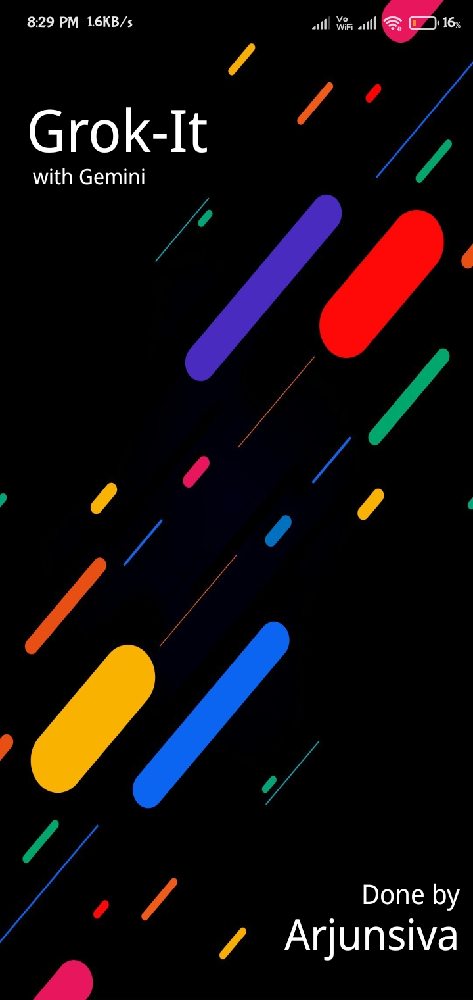
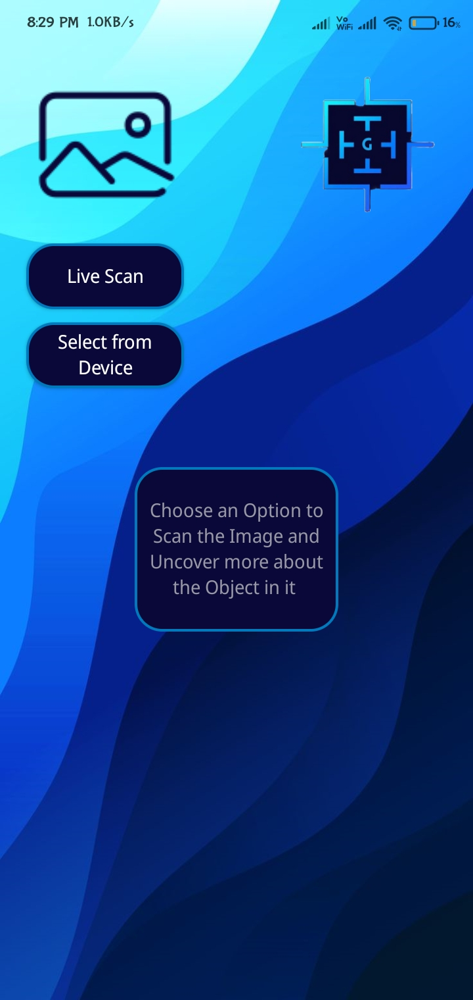
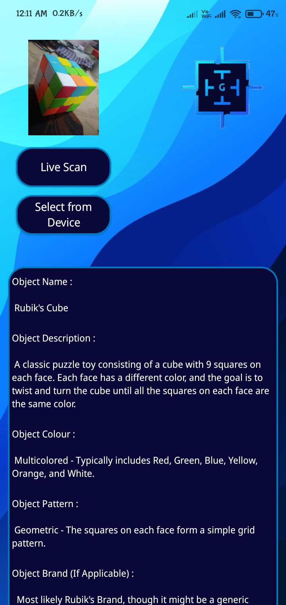
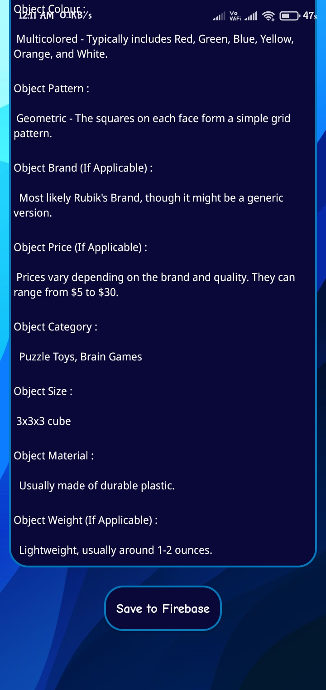

# Grok-It

## Project Description

Grok-It is an object recognition mobile application capable of recognizing physical or real-world objects through the mobile camera or images stored in the mobile's storage to provide comprehensive information about the objects present in it. This application has been developed using Kotlin, Firebase and Google's Gemini AI 1.5 Flash API. This application is specially developed to participate in Google's Gemini API Developer Competition.

## Tech Stack

- Kotlin
- Gemini 1.5 Flash API
- Firebase

## Steps to Run & Use this Application

### Step 1 : Clone Project

Clone this project into your local system.

### Step 2 : Build & Run Project

Build & sync all the necessary dependencies then run the project in the built-in emulator in Android Studio or in your mobile device.

### Step 3 : Click on Live Scan Button

First Option: After the app is launched, click on the "Live Scan" button to start capturing an object using the mobile camera by providing camera permission on that device.

### Step 4 : Click on Select From Device Button

Second Option: Click on the "Select from Device" button to select an image from the local storage by providing the storage permission of that mobile device.

### Step 5 : Click on Save to Firebase

Finally, click on the "Save to Firebase" button to store the displayed attributes to the firebase database.

## Screenshots

<table>
  <tr>
    <td align="center">
       
      <em>Splash Screen</em>
    </td>
    <td align="center">
       
      <em>Home Screen</em>
    </td>
  </tr>
  <tr>
    <td align="center">
       
      <em>Output Screen 1</em>
    </td>
    <td align="center">
       
      <em>Output Screen 2</em>
    </td>
  </tr>
  <tr>
    <td align="center">
       
      <em>Application Logo</em>
    </td>
  </tr>
</table>

## Demo Video

https://github.com/Arjun0106/Grok-It/assets/71865906/d6c8d6b6-3a6f-483b-a0ee-3d26a710db8d
